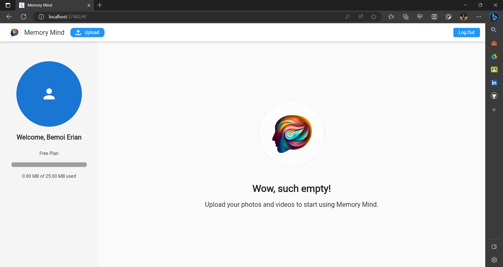

# Memory Mind App

Memory Mind keeps your memories in format of images and videos organized in one place, with email notifications available to remind you of a certain memory on a chosen date.

## Tools

Flutter with BLoC state management using MVVM architecture

## Features

- [x] User registration
- [x] User authentication
- [x] Keep me logged in
- [x] User profile (update profile picture, check used storage)
- [x] Email notifications
- [x] Infinite scroll (pagination)
- [x] Add memory (image/video, date, description)
- [x] Delete memory
- [x] Update memory
- [x] View memory details (image/video, date, description)
- [x] Watch videos

## Screenshots

